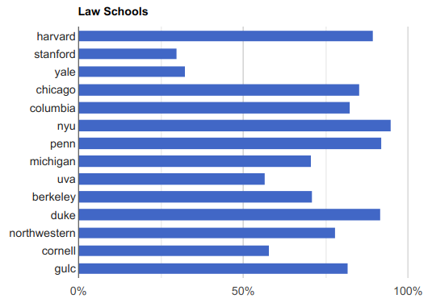
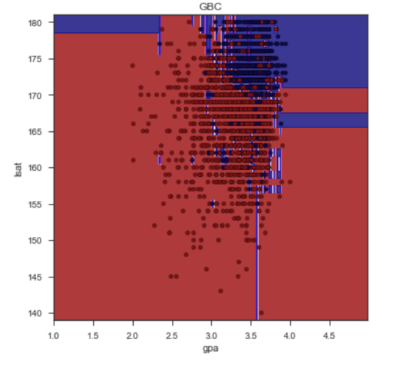

# Law School Chances

A Python Flask + Sklearn API that provides a score given a candidate profile for each of the top 14 U.S. law schools.

Originally started as a side project after doing research for a friend who was trying to get into law school, then scaled the project by adding additional school models. The data is available at mylsn.info and is collected from LawSchoolNumbers.com.

[Check out a live demo here!](https://schoolpredict.com)

## Tools
**Data analysis and model experiments**: Jupyter, sklearn, XGBoost, Pandas

**Serving the models in dev**: Flask, nginx, gunicorn, docker

**Production demo**: ReactJS, AWS Lambda, Netlify CI/CD Python (Flask)

## Methodology
### Data Prep
For this tool, models tailored to each of the top 14 schools were created. The dataset was all from LawSchoolNumbers.com. 
Dataset was first cleaned and prepared for model selection by filtering extremely incomplete or records with impossible values (e.g., LSAT scores of 100 or GPAs of less than 1.0). Missing information was imputed with the mean. All categorical features were grouped prior to one-hot-encoding for simplification, meaning that the "STEM" major choice is a collection of majors in that category.

### Model Selection
The performance of several machine learning models was evaluated: logistic regression, 
support vector machines, gradient boosting classifiers (GBC's), decision trees, and k-nearest neighbors.

### Cross-validation and Testing

A grid search was done to evaluate a reasonable hyper-parameter space for each model. For testing purposes,
20% of the law school admission data was set aside due to the large size of the data. The StratifiedKFold function was used with 4 folds, and the original holdout set was stratified in order to maintain class proportions.

### Evaluation
Ultimately, the Gradient Boosted Classifier outperformed the other models in terms of precision/recall. 
Applicants could be admitted to multiple schools, so one model per school was trained as a simplification.

## Roadmap

A visualization of the decision surface along the LSAT/GPA dimensions for each of the schools is planned. 

